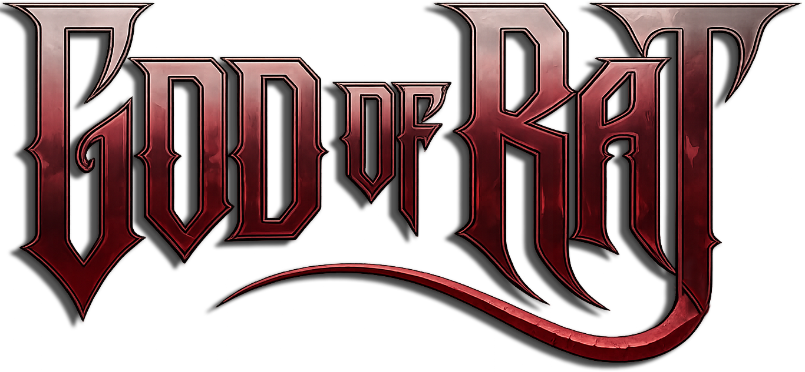
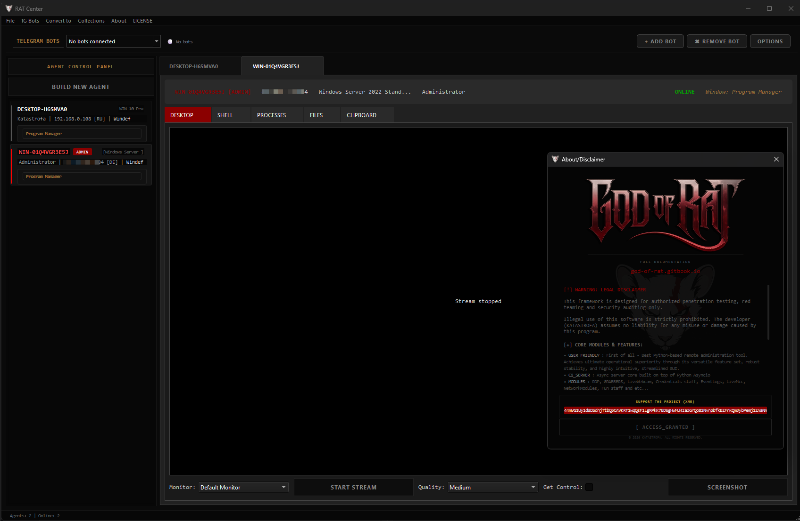

<p align="center">
  
</p>

<p align="center">
  
</p>

<p align="center">
  <b>THE BEST PYTHON RAT FRAMEWORK</b>
</p>
<p align="center">
  <b>⚠️For authorized pentest only⚠️</b>
</p>
<p align="center">
  <a href="https://god-of-rat.gitbook.io/god-of-rat">
    
  </a>
</p>

<p align="center">
  
  
  
</p>

<p align="center">
  <sub><i>I made it totally free for you guys, and would appreciate any help (not for coffee, but first car)</i></sub>
</p>

<p align="center">
  <br>
  <sub><sup><small><b>XMR</b></small></sup></sub>
</p>

<p align="center">
  <sub><sup><i>44mVG1Uy1dsDSdnjTtbQ5CAVKRT1wqQsF1LgRPkK7ED6gHWMU4za3GrQo82NvnpbfkBZFnKQm3ybPemj1ZAaNAsyL2DfVhq</i></sup></sub><br>
</p>

---

<p align="center">
  <b>This is the most convenient and user-friendly Python RAT framework, async-powered and a pure joy to use.</b>
</p>

<p align="center">
  
</p>


---

## Features

- ### Live FULL Control
Control the target screen via live stream. **FULL CONTROL** with mouse and keyboard input. Stream the target's screen live, watch the webcam, listen to the microphone, take screenshots, or log every keystroke — either continuously or for a set amount of time.

- ### Credentials Harvesting
Extract Wi-Fi **passwords**, browser secrets (Chrome, Edge, Firefox, Brave, Opera), OpenVPN credentials, **STEAM** tokens, **Discord** tokens, and **Telegram** tdata session data.

- ### Interactive Agent Builder
A simple GUI to build your payload. Pick which modules you want, add an AES key, change the icon or copy the icon from another EXE, fake file metadata, enable Anti-VM protection, pad the file size, or set up automatic persistence. Everything happens before you click compile.

- ### Telegram Bot Multiplexer
Run several Telegram bots simultaneously. Each user gets their own isolated session, making team collaboration clean and organized.

- ### AES-256 Encryption
All traffic between the server, controller, and agents is encrypted. For testing purposes, you can switch to plain text mode.

- ### Remote Shell
An interactive command line that works exactly like your local terminal. Execute any system command and see the output in real time.

- ### File System Manager
Browse remote files, upload by dragging and dropping, download anything, delete files, or run executables. Folders are automatically zipped before upload.

- ### Evasion & Persistence
UAC Bypass via Fodhelper, disable Defender and Firewall, Anti-VM detection, Event Log cleaner, Smart Trace cleaner, and various persistence techniques.

- ### Windows Management
Edit the registry remotely, manage services and network connections, view scheduled tasks, control WMI subscriptions, and kill or monitor processes.

- ### Fun Modules
Screen zoom, mouse inverter, drunk mouse, window shake, mouse trail ghosts, persistent alert boxes, disable Task Manager, and more.

---
<p align="center">
<sub>Feel free to submit PRs, suggest new modules, or improve existing ones.</sub>
</p>
<p align="center">
<sub>Let's make this framework a community effort.</sub>
</p>

---

### ◈ QUICK START

```bash
git clone https://github.com/Katastrofa0/GOD-OF-RAT.git
cd GOD-OF-RAT
pip install -r requirements.txt
```
```bash
python server.py [--aes-key '$aeskey'] [--cert 'serv.crt' --key 'serv.key' ]  # Start server | with WSS:// (optional)
python controller.py  # Launch GUI (another terminal)

# Make sure encryption.py is in the same directory as server.py
```
If you encountered some PyAudio & Crypto trouble, install it like this:
```bash
pip install pipwin
pipwin install pyaudio

pip uninstall crypto pycrypto
pip install pycryptodome
```

Also For best icon extraction experience, download and install VC_redist:
```bash
https://aka.ms/vs/17/release/vc_redist.x64.exe
```

<p align="center">
  <b>Comprehensive documentation with setup instructions and detailed module descriptions is available here:</b>
</p>
<p align="center">
  <b>https://god-of-rat.gitbook.io/god-of-rat</b>
</p>

---

<p align="center">
  <a href="https://star-history.com/#Katastrofa0/GOD-OF-RAT&Date">
    
  </a>
</p>
